# ESP32 PM Sensor: Portable Air Quality & Noise Logger


A portable ESP32 logger for **particulate matter (PM1.0, PM2.5, PM10)**. It reads a **Plantower PMS5003** sensor and records each sample with:

- the time from a **DS3231 RTC**
- the location from a **GPS module**
- the ambient **noise level** from an **INMP441 I2S microphone**

Every record is saved to a **microSD card** as CSV, so the device works fully offline. You can carry it around, then plot the route and the pollution levels afterwards.

The project includes the firmware, a custom **PCB** (schematic, Gerbers, 3D model) and a **3D-printed enclosure**.

<p align="center">
  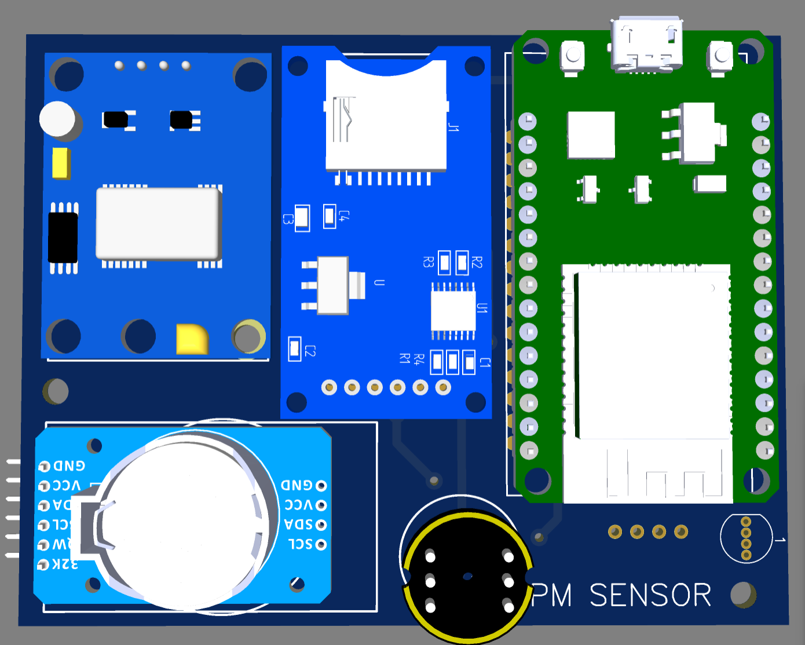
  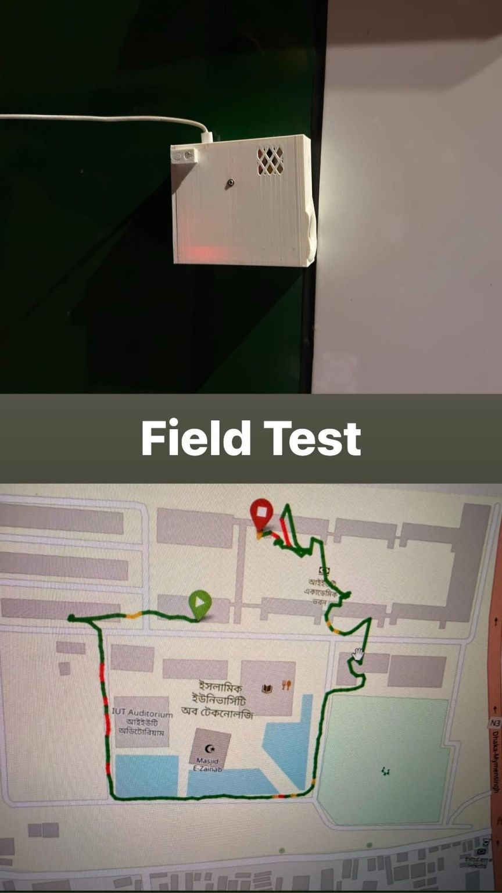
</p>

---

## Features

- **PM1.0 / PM2.5 / PM10** in µg/m³ from the PMS5003. Frames are checksum-validated, and PM2.5 gets light smoothing.
- **Timestamps** come from the DS3231 RTC, which keeps time on its coin cell without internet.
- **GPS** logs latitude, longitude, speed (km/h) and the satellite count with every reading.
- **Noise level** is sampled from the INMP441 I2S microphone as RMS and dB. The mic is only powered on during sampling.
- **Offline storage:** readings are appended to `/airlog.csv` on the SD card and flushed after every write.
- **Custom PCB:** a 2-layer board that carries the ESP32 DevKit, RTC, GPS, SD, mic, PMS header and an RGB status LED.
- **3D-printed enclosure:** STL files for the body and lid are included.

---

## Development History

| Version | Folder | What changed |
|---|---|---|
| **v1** | `firmware/previous-versions/v1_firebase_oled` | ESP32 + PMS5003 + OLED + SD. NTP time. Uploaded live data to **Firebase** and showed it on a web dashboard. Buttons changed the logging interval. |
| **v2** | `firmware/previous-versions/v2_gps_rtc_leds` | **Firebase removed**, fully offline. Added the **DS3231 RTC** (synced from NTP once at boot) and **GPS**. Added status LEDs and interval buttons. |
| **v3** | `firmware/previous-versions/v3_noise_mic` | Added the **INMP441 microphone** for noise level. Added PMS checksum validation and PM2.5 smoothing. |
| **v4 (current)** | `firmware/PM_Sensor` | Same as v3, but the mic is switched on only while sampling, to save power and reduce interference. |

---

## System Overview

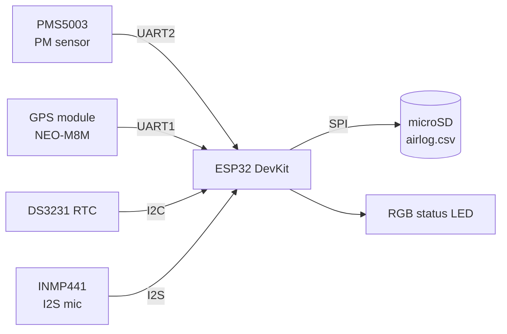
```mermaid
flowchart LR
    PMS[PMS5003<br/>PM sensor] -->|UART2| ESP[ESP32 DevKit]
    GPS[GPS module<br/>NEO-M8M] -->|UART1| ESP
    RTC[DS3231 RTC] -->|I2C| ESP
    MIC[INMP441<br/>I2S mic] -->|I2S| ESP
    ESP -->|SPI| SD[(microSD<br/>airlog.csv)]
    ESP --> LED[RGB status LED]
```

**Every 5 seconds the firmware:**

1. Reads and validates a 32-byte PMS5003 frame (header `0x42 0x4D`, checksum of bytes 0–29).
2. Smooths PM2.5 by averaging it with the previous reading.
3. Turns the mic on, reads 512 I2S samples at 16 kHz, turns the mic off, and computes RMS and dB.
4. Reads the time from the RTC and the latest GPS fix. The GPS is parsed continuously in the loop.
5. Prints everything to Serial (115200 baud) and appends one CSV row to the SD card.

---

## Hardware

| Component | Qty | Notes |
|---|---|---|
| ESP32 DevKit (ESP32-WROOM-32, 30-pin) | 1 | Main controller |
| Plantower PMS5003 | 1 | Laser particle sensor. Powered from **5 V** (VIN). |
| DS3231 RTC module | 1 | With a CR2032 backup cell |
| GPS module (NEO-M8M on the PCB) | 1 | Any u-blox NEO module with 9600-baud NMEA works (for example NEO-6M or M8N) |
| INMP441 I2S MEMS microphone | 1 | L/R tied to GND (left channel) |
| microSD card module (SPI) | 1 | Card formatted as FAT32 |
| RGB LED, common cathode | 1 | Status LED on the PCB |
| Custom PCB | 1 | Gerbers are in `hardware/pcb/` |
| 3D-printed enclosure | 1 | STLs are in `hardware/3d/` |

### Pin Map

These pins match both the firmware and the PCB schematic.

| Module | Signal | ESP32 GPIO |
|---|---|---|
| **PMS5003** | TXD → ESP RX | **13** |
| | RXD ← ESP TX | **14** |
| | 5V / GND | VIN / GND |
| **GPS** | TX → ESP RX | **4** |
| | RX ← ESP TX | **2** |
| **DS3231 RTC** | SDA | **21** |
| | SCL | **22** |
| **INMP441** | SCK (BCLK) | **16** |
| | WS (LRCLK) | **17** |
| | SD (data) | **34** |
| | L/R | GND |
| | VDD | 3V3 |
| **microSD** | CS | **5** |
| | SCK | **18** |
| | MISO | **19** |
| | MOSI | **23** |
| **RGB LED** | Red / Green / Blue | **25 / 26 / 27** (common cathode → GND) |

<p align="center">
  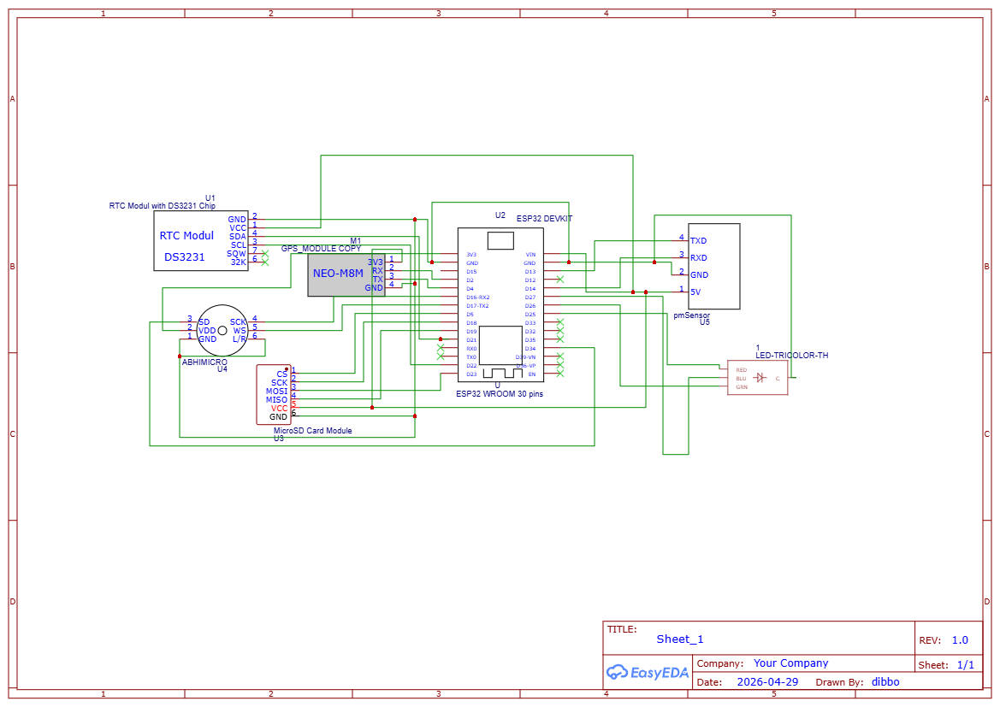
</p>

---

## Getting Started

### 1. Install the tools

- **Arduino IDE** with the **ESP32 board package** (*Boards Manager → "esp32" by Espressif*).
- Libraries, from the Library Manager:

| Library | Author | Purpose |
|---|---|---|
| TinyGPSPlus | Mikal Hart | NMEA parsing |
| RTClib | Adafruit | DS3231 |

`Wire`, `SPI`, `SD`, `Preferences`, `HardwareSerial` and the I2S driver (`driver/i2s.h`) come with the ESP32 core.

> The firmware uses the **legacy I2S driver** (`driver/i2s.h`). It is deprecated in ESP32 core 3.x. If you get I2S compile errors, install ESP32 core **2.0.x**.

### 2. Set the RTC once

The current firmware reads the time from the DS3231 but never sets it. Set the clock once, and the coin cell will keep it:

- **Option A:** flash `firmware/previous-versions/v2_gps_rtc_leds`. Put your WiFi name and password in the sketch first. It syncs the RTC from NTP (GMT+6) at boot.
- **Option B:** add this line to `setup()` once, upload, then remove it and upload again:

  ```cpp
  rtc.adjust(DateTime(F(__DATE__), F(__TIME__)));
  ```

### 3. Flash the firmware

1. Open `firmware/PM_Sensor/PM_Sensor.ino`.
2. Select **Board: ESP32 Dev Module** and the right COM port, then click **Upload**.
3. Insert a FAT32 microSD card and power the board.
4. Open the Serial Monitor at **115200 baud**. You should see `SYSTEM READY`, then one block of readings every 5 s.

To change the logging rate, edit `loggingInterval` (in milliseconds) near the top of the sketch.

---

## Data Format

The log is appended to `/airlog.csv` on the SD card:

```csv
Time,PM1,PM2.5,PM10,Lat,Lon,Speed,Sats,RMS,dB
2026-06-17 16:05:10,21,34,41,23.948123,90.379456,3.41,9,152.37,43.66
```

| Column | Unit | Description |
|---|---|---|
| `Time` | `YYYY-MM-DD HH:MM:SS` | From the DS3231 RTC |
| `PM1`, `PM2.5`, `PM10` | µg/m³ | Atmospheric-environment values. PM2.5 is smoothed. |
| `Lat`, `Lon` | degrees | GPS position (`0.000000` until the first fix) |
| `Speed` | km/h | GPS ground speed |
| `Sats` | count | Satellites in view |
| `RMS` | raw | RMS of 512 mic samples |
| `dB` | dB (relative) | `20·log10(RMS)`. This is a relative level, not calibrated dB SPL. |

To map a walk, import the CSV into Google My Maps, QGIS or Python/folium and color the points by PM2.5.

---

## Hardware Files

| Path | Contents |
|---|---|
| `hardware/schematic/Schematic_PM_Sensor.png` | Full schematic (EasyEDA) |
| `hardware/pcb/Gerber_PM_Sensor.zip` | Gerber and drill files, ready to upload to a PCB fab (JLCPCB, PCBWay, …) |
| `hardware/pcb/PCB_PM_Sensor.dxf` | PCB outline and layout (DXF) |
| `hardware/3d/PCB_PM_Sensor_3D_OBJ.zip` | 3D model of the assembled PCB (OBJ + MTL) |
| `hardware/3d/enclosure_body.stl` | Enclosure body, about 152 × 112 × 47 mm |
| `hardware/3d/enclosure_lid.stl` | Enclosure lid, about 140 × 112 × 7 mm |

### PCB

<p align="center">
  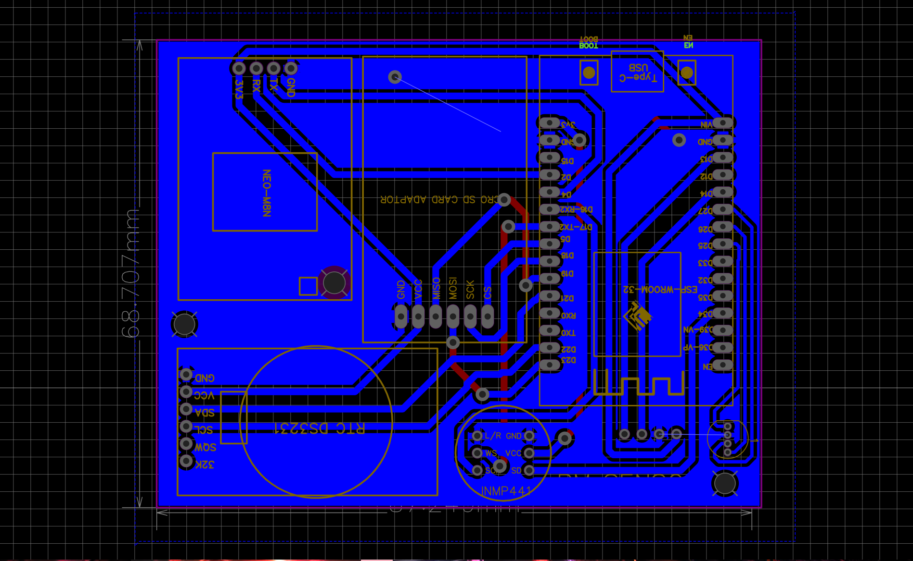
  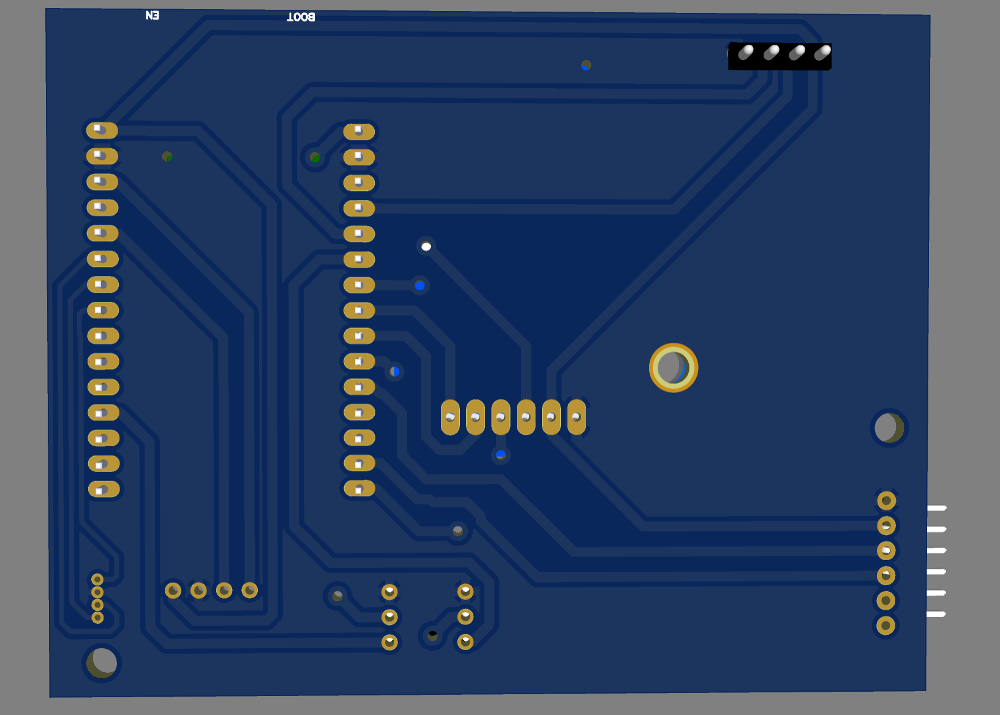
</p>

### Enclosure Iterations

| First design | Second design | Final design |
|---|---|---|
| 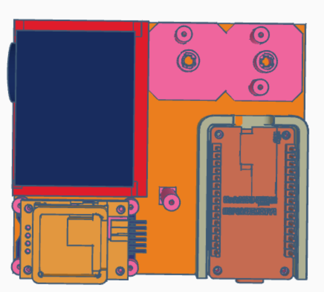 | 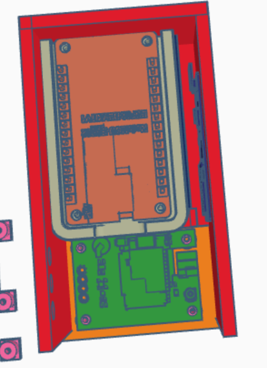 | 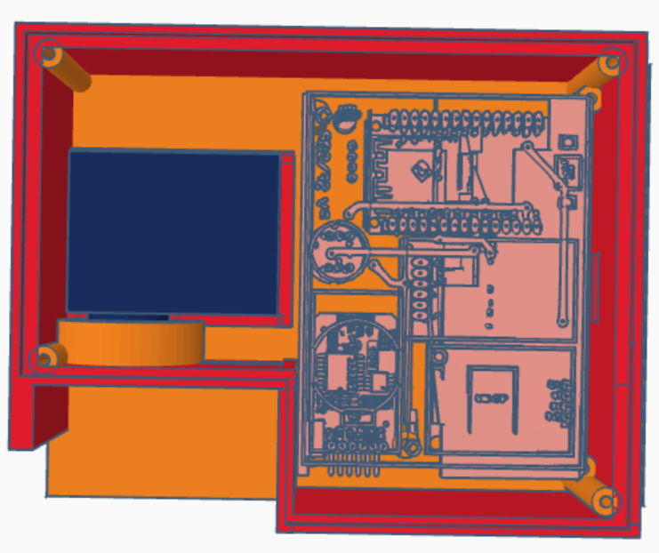 |
| 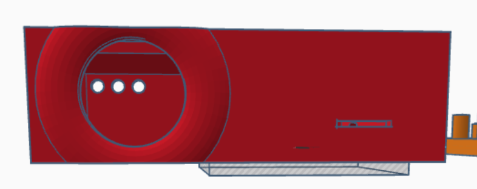 | 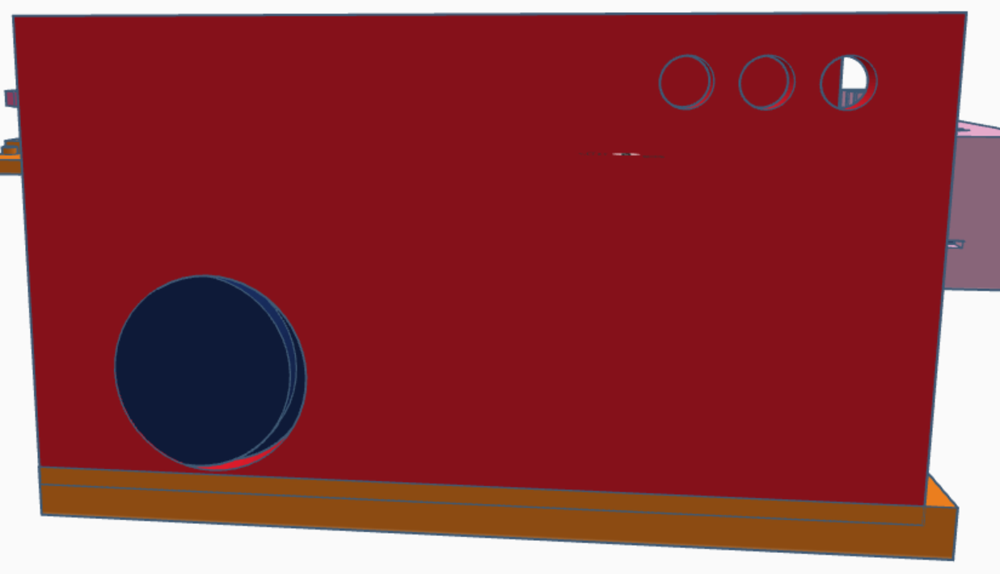 | 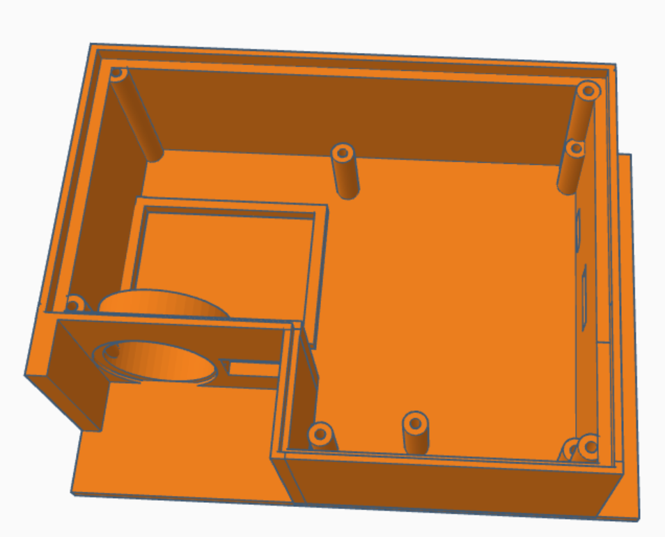 |

---

## Prototypes & Testing

| Prototype 1 (perfboard) | Prototype 2 (perfboard) |
|---|---|
| 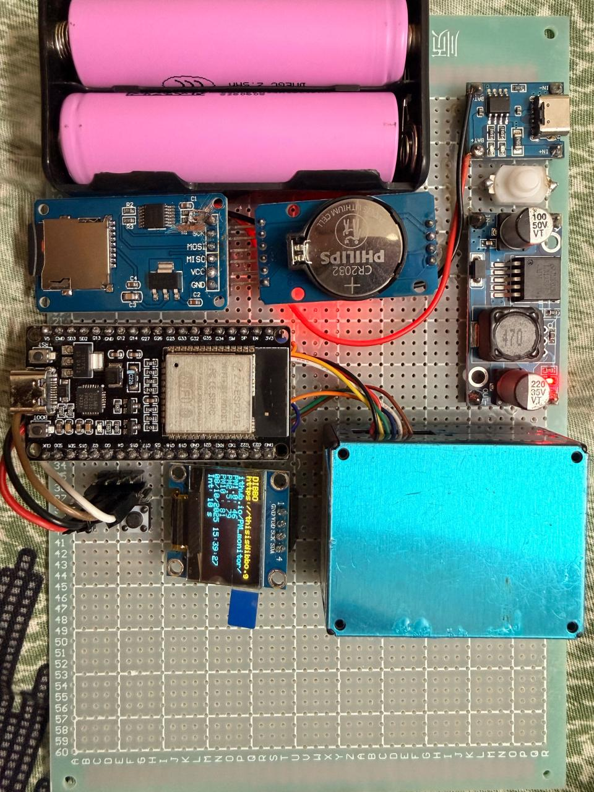 | 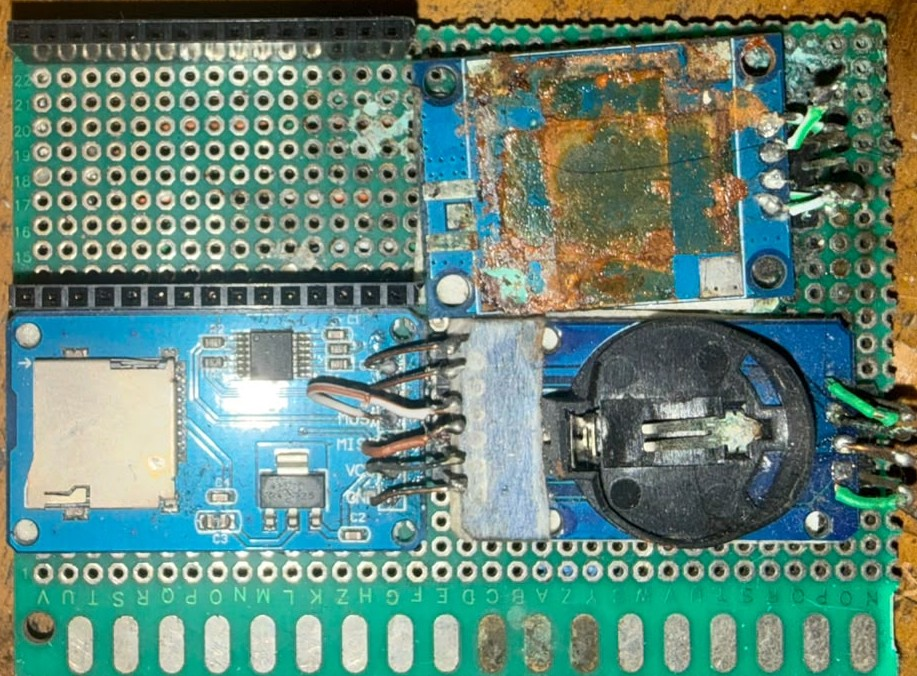 |
| 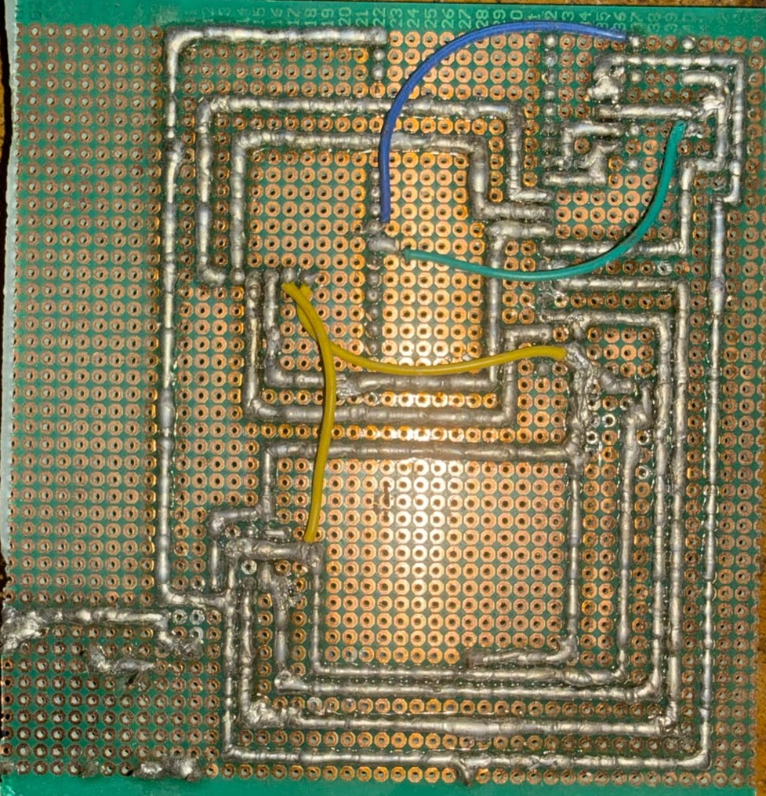 | 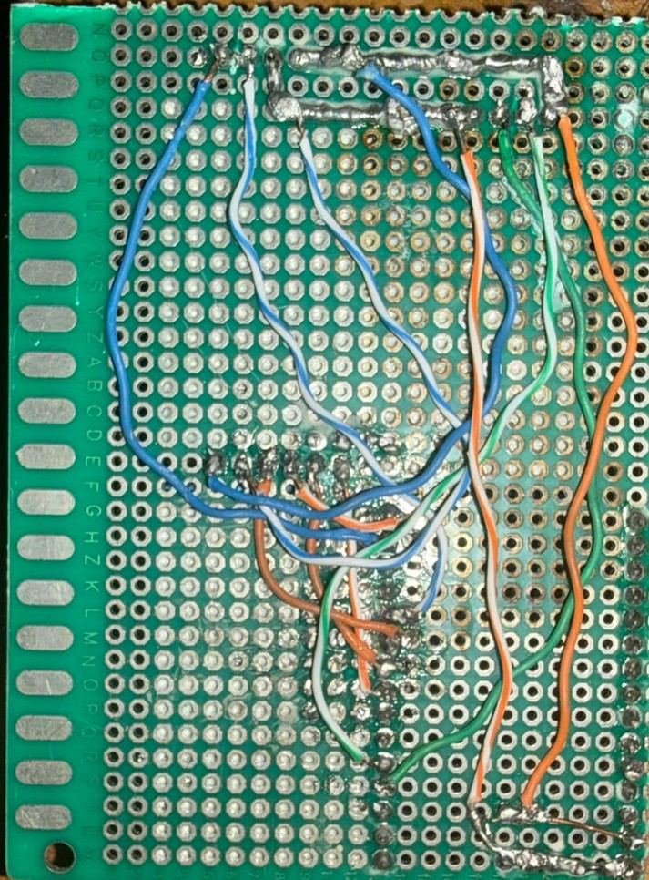 |

Prototype 1 was built on perfboard with:

- the ESP32, PMS5003, OLED, microSD and DS3231
- a 2 × 18650 battery pack with a USB-C charger and a boost converter

**Field test:** the image below shows the device mounted in its 3D-printed enclosure, and the GPS route it logged around the IUT campus.

<p align="center"></p>

---

## Legacy: Firebase Cloud Version (v1)

The first version uploaded every reading to **Firebase Realtime Database**. A web dashboard (`web-dashboard/index.html`, hosted on GitHub Pages) could:

- show live readings from anywhere
- rename the device
- change the logging interval remotely
- download all records as CSV

An SSD1306 OLED showed the latest values on the device itself.

The cloud link was later **removed** to make the logger fully offline and portable. The code is kept for reference. All credentials in it have been replaced with placeholders, so fill in your own Firebase project details if you want to run it again.

| OLED display | Firebase database | Web dashboard |
|---|---|---|
| 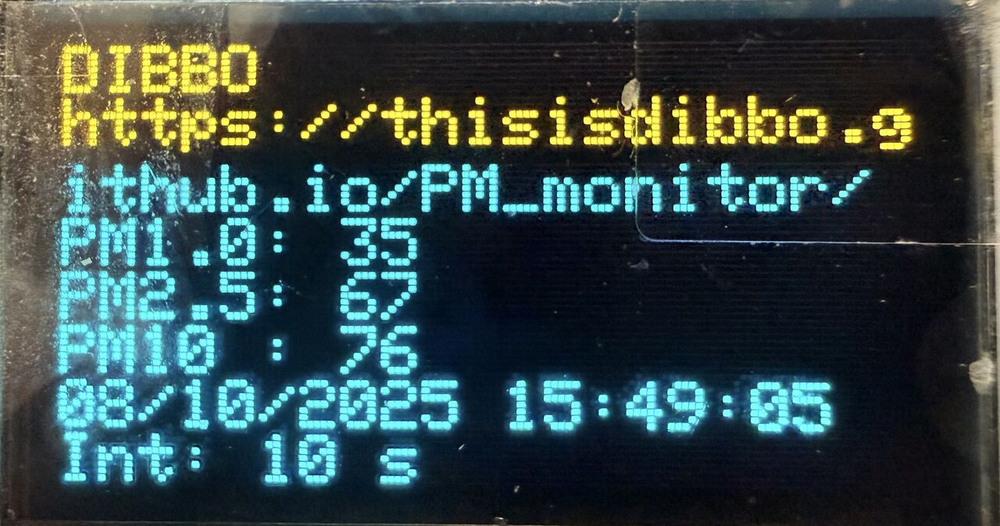 | 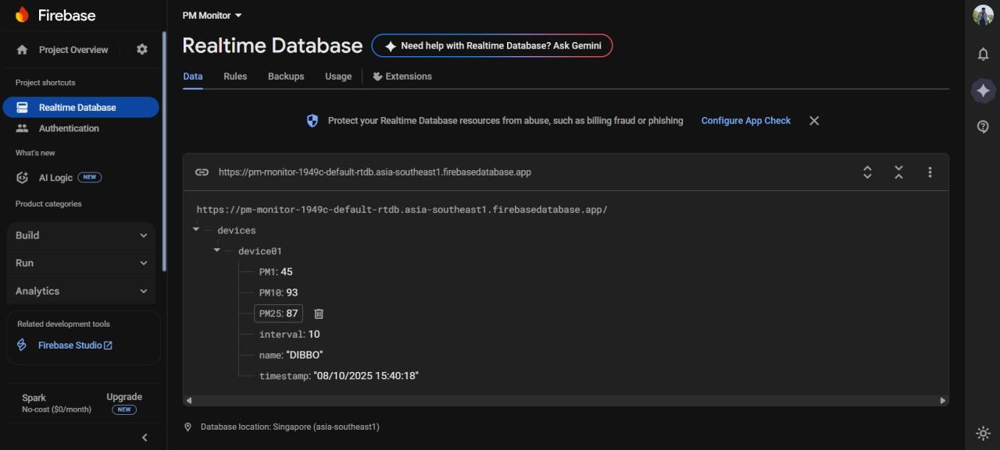 | 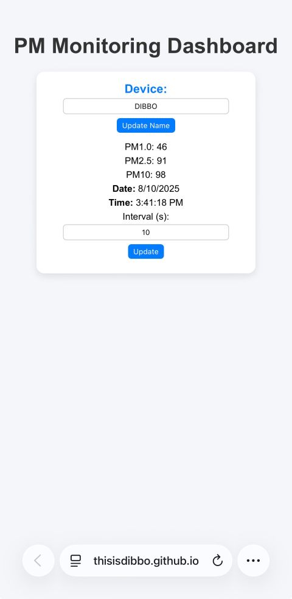 |

---

## Known Limitations

- **Noise dB is uncalibrated.** It is relative (`20·log10(RMS)` of the raw samples) and is not an SPL meter reading.
- **No GPS fix means `0.000000` coordinates.** Give the GPS a clear view of the sky; a cold start can take a few minutes.
- **The RGB LED isn't used by the current firmware.** It is wired to GPIO 25/26/27 on the PCB and driven by the v2 firmware.
- **The first PM2.5 value after boot reads low.** It is averaged with an initial value of 0.
- **The logging interval is fixed** at 5 s in the current firmware. The v1 and v2 firmware used buttons on GPIO 32/33 to change it.

---

## Repository Structure

```
ESP32-PM-Sensor/
├── firmware/
│   ├── PM_Sensor/PM_Sensor.ino          # Current firmware (v4)
│   └── previous-versions/
│       ├── v1_firebase_oled/            # Firebase + OLED + web dashboard
│       ├── v2_gps_rtc_leds/             # Offline, RTC + GPS + LEDs + buttons
│       └── v3_noise_mic/                # + INMP441 noise measurement
├── web-dashboard/index.html             # v1 Firebase dashboard (legacy)
├── hardware/
│   ├── schematic/                       # Schematic PNG
│   ├── pcb/                             # Gerber ZIP + DXF
│   └── 3d/                              # Enclosure STLs + PCB 3D model
├── images/                              # Photos, renders, screenshots
└── README.md
```

---

## Author

**Md. Mahin Rahman**
Department of Electrical and Electronic Engineering
Islamic University of Technology (IUT), Gazipur, Bangladesh
GitHub: [@thisisdibbo](https://github.com/thisisdibbo)
